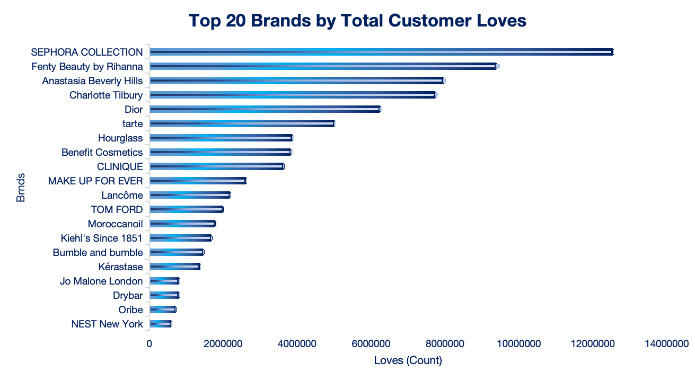
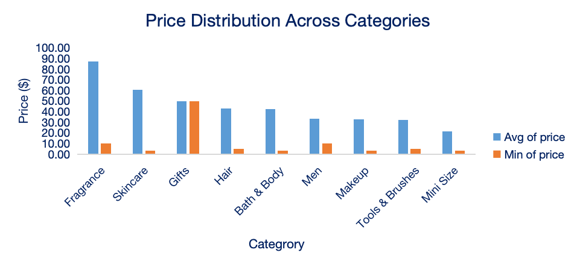
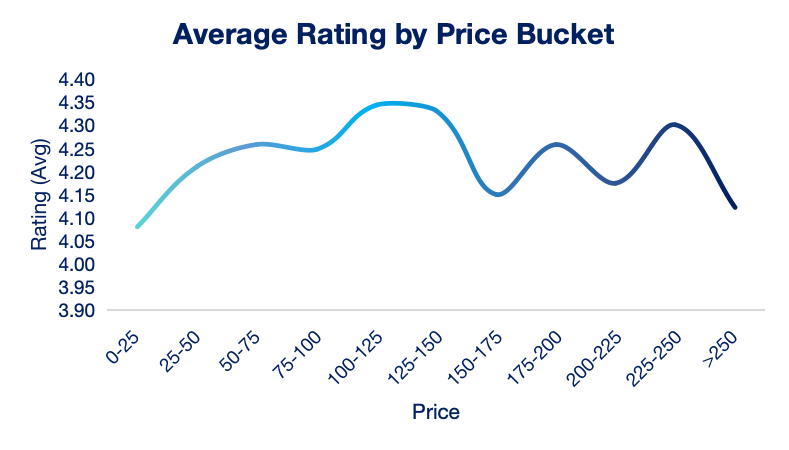
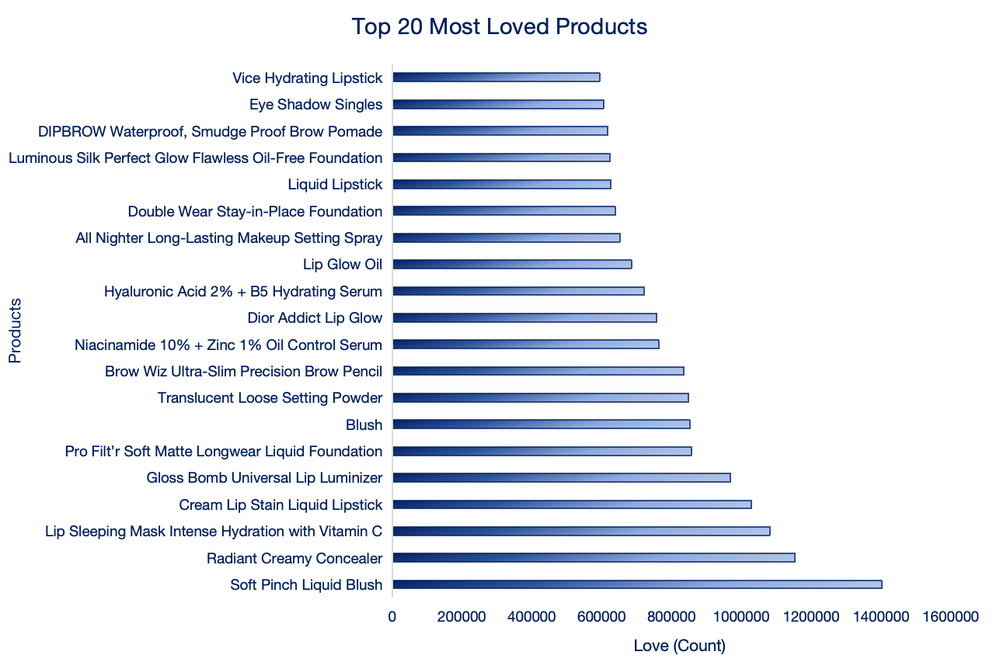
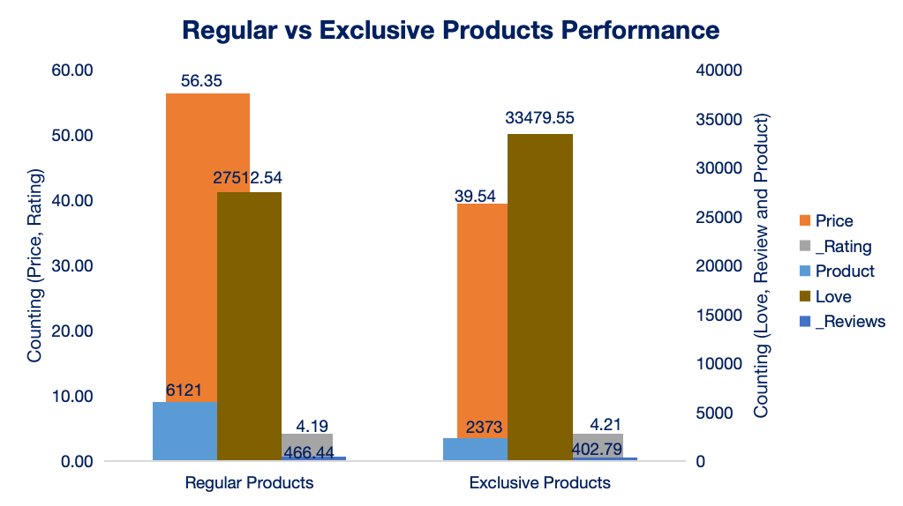
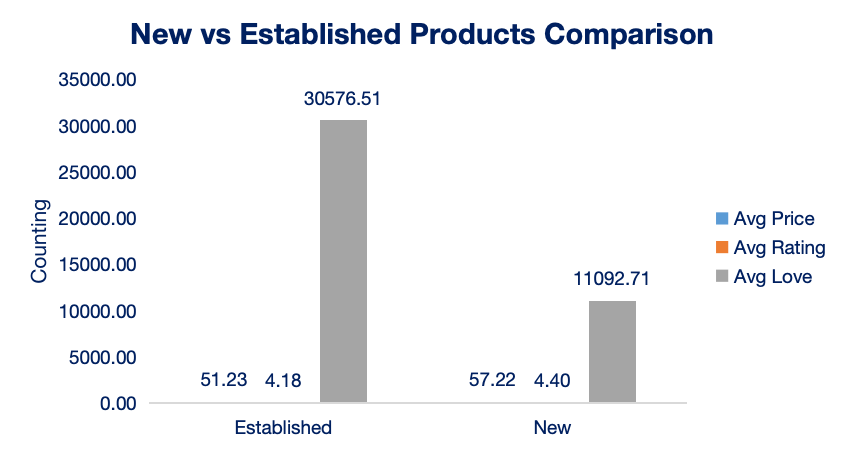
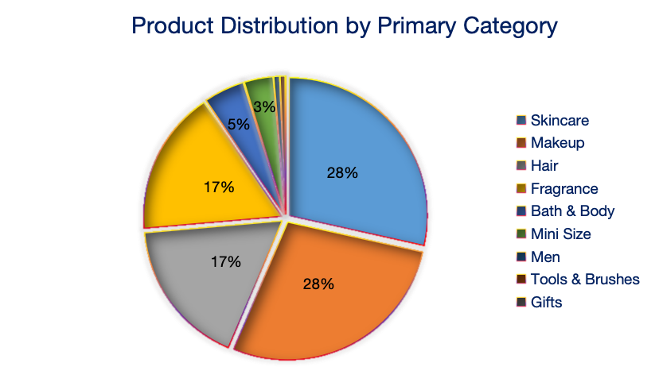
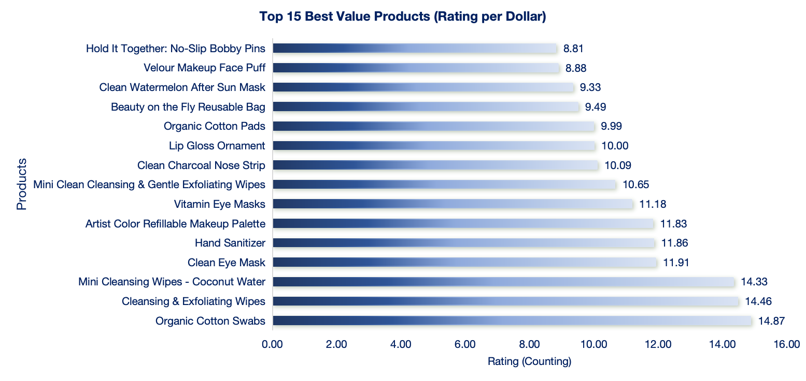
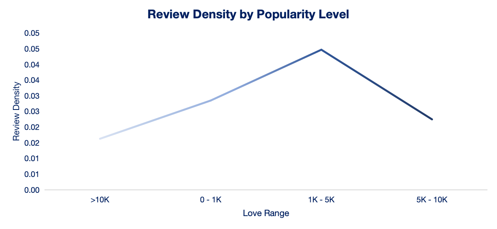
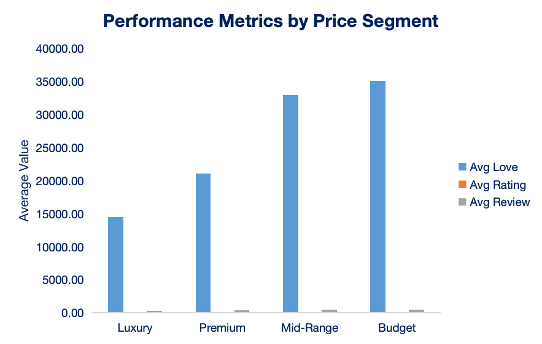

# 💄 Sephora Beauty Products — Data Visualization in Excel

**An evidence-based approach to visual analytics on 8,494 retail products**


---

## 🎯 The Question

The beauty industry sells luxury and exclusivity hard. I wanted to check if the data backs that up.

So I took a real Sephora catalogue from Kaggle (8,494 products, 27 original columns) and asked a simple thing: can I answer real business questions about price, rating and popularity just by reading charts? No machine learning, no fancy tooling. Just a clean Excel model and visual rules that hold up.

The short answer surprised me. Price and rating are barely connected. You don't have to spend a lot to get a well-rated product.

---

## 📊 Dataset & Data Model

**Source:** [Sephora Products and Skincare Reviews](https://www.kaggle.com/datasets/nadyinky/sephora-products-and-skincare-reviews) (Kaggle — `nadyinky/sephora-products-and-skincare-reviews`)

| Item | Value |
|------|-------|
| Products (rows) | 8,494 |
| Original columns | 27 |
| Calculated columns added | 8 |
| Brands | 304 |
| Category combinations | 174 |

**How the workbook is structured:**

- **`Mainly`** — the fact table. One row per product, 48 fields, including the 8 calculated columns. Brand and category attributes sit here as descriptive fields.
- **`Price_Ranges`** — a dimension table with 5 bands (No Price, Budget, Mid-Range, Premium, Luxury) and their min/max thresholds.
- **`Question 01`–`Question 10`** — one tab per business question, each with its own purpose-built chart.
- **Review sheets** — the raw review detail that feeds the engagement metrics through VLOOKUP.

> Note on the model: brand and category live inside the fact table rather than in fully separate dimension tables. The price-range dimension is the one broken out cleanly. That keeps the workbook readable for a 10-question analysis without over-engineering the schema.

---

## 🧮 Calculated Fields (the interesting part)

The 8 calculated columns are where the analysis actually happens. Two of them carry most of the weight.

**Value Score** — rating per dollar, scaled by 10 so the numbers stay tidy:

```excel
=IF(price>0, (rating/price)*10, 0)
```

This is the one that flips the story. Sort the list by Value Score and cheap drugstore items land right next to premium brands at the top.

**Review Density** — written reviews divided by loves, a proxy for how deep the engagement runs:

```excel
=IF(loves>0, reviews/loves, 0)
```

Viral products (thousands of loves) tend to have a low ratio here. Lots of people tap the heart, far fewer write anything.

**Price Range** — buckets every product into a band:

```excel
=IF(price=0,"No Price",IF(price<25,"Budget",IF(price<50,"Mid-Range",IF(price<100,"Premium","Luxury"))))
```

Plus: `High_Rating_Flag` (rating ≥ 4), `Exclusivity` (Limited / Sephora Exclusive), `Stock` status (New vs Established), and a popularity tier based on loves count. VLOOKUP pulls helpfulness and feedback counts in from the review sheets.

---

## ❓ The 10 Business Questions

| # | Question | Chart |
|---|----------|-------|
| Q1 | Which brands get the most loves? | Horizontal bar |
| Q2 | How does price vary across categories? | Clustered bar |
| Q3 | Is price related to rating? | Line |
| Q4 | Top 20 most-loved products | Horizontal bar |
| Q5 | How do exclusive products perform? | Clustered bar |
| Q6 | New vs established products | Clustered bar |
| Q7 | Product distribution across categories | Pie |
| Q8 | Best value (rating per dollar) | Horizontal bar |
| Q9 | Review Density by Popularity Level | Line |
| Q10 | How price segments compare | Clustered bar |

---

## 📈 Visualization Choices

Most charts here are bar charts, and that's on purpose. Cleveland and McGill (1984) showed that people read length better than any other visual channel. Bars on a shared baseline are hard to misread. When brand names got long, I rotated the bars sideways so labels fit.

I used one pie chart, for Q7. Pie charts get a bad rap, and Cleveland and McGill rank angle perception low. But Few (2012) makes the case that pies are fine for parts of a whole when the slice count is small. Q7 just shows the category split. Nobody has to measure a five-degree difference.

The design stays quiet. Following Tufte (1997) on data-ink ratio: no gradients, no 3D. I also avoided red and green together so the charts work for people with colour vision deficiency.

---

## 🔑 Key Findings

**Brand attention is concentrated.** The top ~20 names take most of the loves and reviews. Sephora stocks a huge catalogue, but people stick with what they know.

**Fragrance is expensive across the board.** Skincare and makeup are all over the place. You'll find a cheap lipstick next to a pricey one, and the price doesn't tell you which is better.

**Price and rating barely move together.** A $15 moisturiser can out-rate a $200 cream. Satisfaction in this category isn't something you buy. It's whether the product works for you.

**Limited editions get the loves, not the ratings.** Scarcity creates buzz. The star ratings sit right around average. People react to packaging and rarity, not to the formula.

**Budget products dominate value.** If you rank by rating per dollar, the lower price tiers own the top of the list.

**Viral ≠ deep.** The products with thousands of loves tend to have fewer written reviews per love. Broad engagement, shallow engagement.

The takeaway: trust the ratings more than the price tag.

---

## 📷 Dashboard


| | |
|---|---|
|  |  |
|  |  |
|  |  |
|  |  |
|  |  |

---

## 🗂️ Repository Structure

```
Sephora-Data-Visualization/
├── README.md
├── workbook/
│   └── Sephora_Dashboard_Marcelo_Oliveira.xlsx
├── report/
│   ├── Academic_Report.pdf
│   └── Explanatory_Report.pdf
└── images/
    ├── 00-dashboard-overview.png
    └── 01–10 question charts
```

---

## 🎓 Academic Context

Submitted for the **Data Visualization** module of the Data Analytics programme at **City College Dublin** (2026). Graded **88/100**.

Professor's feedback:

> *"Excellent analytical capability is demonstrated through the thoughtful organisation of data and the effective use of advanced visualisation techniques. Visualisations communicate insights effectively through appropriate chart selection, clear axes, and consistent formatting."*
> — Prof. Neeraj Jha

---

## 📚 References

Cleveland, W.S. & McGill, R. (1984). *Graphical perception: theory, experimentation, and application to the development of graphical methods.* Journal of the American Statistical Association, 79(387), 531–554.

Few, S. (2012). *Show Me the Numbers: Designing Tables and Graphs to Enlighten* (2nd ed.). Analytics Press.

Tufte, E.R. (1997). *The Visual Display of Quantitative Information* (2nd ed.). Graphics Press.

Kelleher, C. & Wagener, T. (2011). *Ten guidelines for effective data visualization in scientific publications.* Environmental Modelling and Software, 26(6), 822–827.

---

## 📫 Connect

[](https://www.linkedin.com/in/ofonsecamarcelo)
[](mailto:marcelo.dafonsecaoliveira@gmail.com)
[](https://github.com/mfonsecaoliveira)
